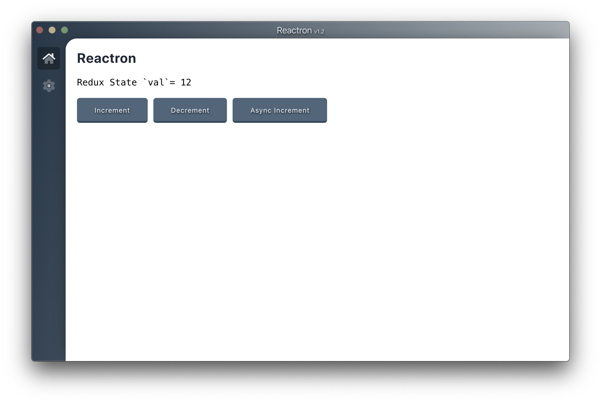

## Reactron

Just another React-Electron Boilerplate.

#### Why Reactron?

Reactron uses Electron, React (JSX), Redux, React Router, Webpack and React Hot Loader for rapid application development.

#### Devtools
- React Devtools.
- Redux Devtools.

#### Todo
- Auto Updater.
- License managing.
